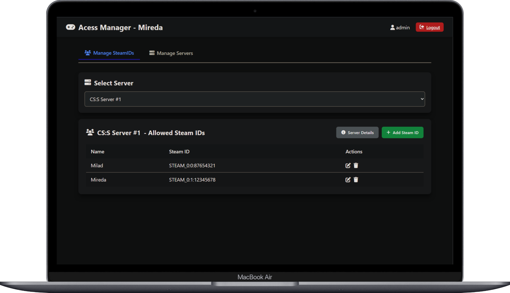
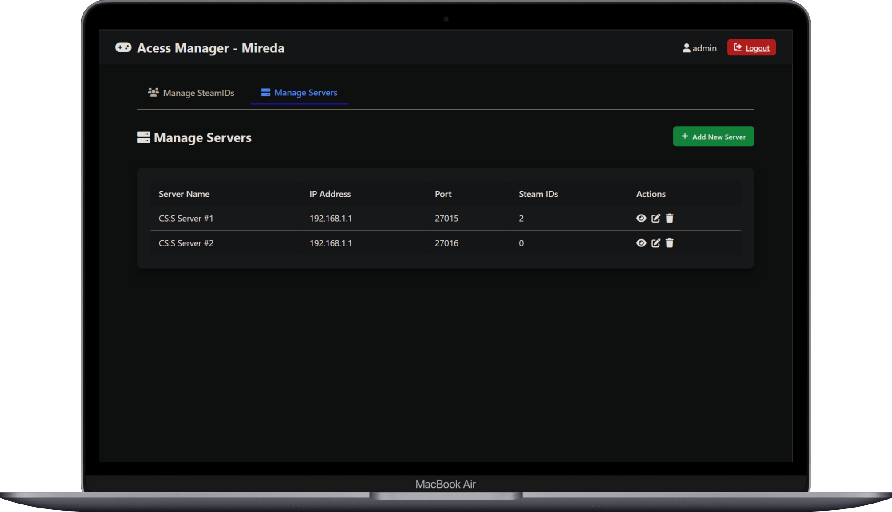

# CS:S Access Manager

A comprehensive access control system for Source Engine servers that provides real-time player allowlist management through a web interface and SourceMod plugin.

## Preview

### Web Management Panel

*Server configuration and Steam ID management interface*


*Main dashboard showing server overview and management options*

## Features

### 🔐 Access Control
- **Real-time allowlist checking** - Players are verified against the API when connecting
- **Multiple server support** - Manage allowlists for multiple Source Engine servers from one interface
- **Admin bypass** - Configurable admin privilege override
- **Fail-safe modes** - Choose between fail-open or fail-closed when API is unreachable

### 🌐 Web Management Panel
- **User-friendly dashboard** - Modern web interface for managing servers and players
- **Server management** - Add, edit, and remove servers with IP/port/RCON configuration
- **Player management** - Add/remove Steam IDs with associated player names
- **Real-time monitoring** - Check API status and server connectivity

### 🔧 SourceMod Plugin
- **Automatic player checking** - Validates players on connect and periodically
- **Admin commands** - In-game commands for checking player status and system health
- **Comprehensive logging** - Debug mode with detailed API interaction logs
- **Flexible configuration** - Extensive ConVar options for customization

## Quick Start

### Prerequisites
- Counter-Strike: Source server with SourceMod installed
- Python 3.6+ for the web interface
- SourceMod extensions: System2, JSON

### Installation

1. **Clone the repository**
   ```bash
   git clone https://github.com/miredaw/SeSdkAccessManager.git
   cd SeSdkAccessManager
   ```

2. **Install Python dependencies**
   ```bash
   pip install flask
   ```

3. **Set up the web interface**
   ```bash
   cd web
   python app.py
   ```
   The web interface will be available at `http://localhost:15500`

4. **Install the SourceMod plugin**
   - Copy `external.sp` to `addons/sourcemod/scripting/`
   - Compile: `spcomp external.sp`
   - Copy the compiled `external.smx` to `addons/sourcemod/plugins/`

5. **Configure the plugin**
   Edit `cfg/sourcemod/Mireda_access_manager.cfg`:
   ```
   sm_accessmanager_api_url "http://your-server:15500/api/check"
   sm_accessmanager_server_name "Your Server Name"
   ```

## Configuration

### Web Interface
- **Default login**: `admin` / `password`
- **Database files**: Stored in `web/db/` directory
- **Port**: 15500 (configurable in `app.py`)

### SourceMod Plugin ConVars
| ConVar | Default | Description |
|--------|---------|-------------|
| `sm_accessmanager_api_url` | `http://localhost:15500/api/check` | API endpoint URL |
| `sm_accessmanager_server_name` | `sv1` | Server name in the web panel |
| `sm_accessmanager_check_interval` | `60.0` | Periodic recheck interval (seconds) |
| `sm_accessmanager_allow_admins` | `0` | Allow admins to bypass allowlist |
| `sm_accessmanager_debug` | `0` | Enable debug logging |
| `sm_accessmanager_fail_open` | `1` | Allow players when API is unreachable |

## Admin Commands

### In-Game Commands (SourceMod)
| Command | Permission | Description |
|---------|------------|-------------|
| `sm_allowlist_check <player>` | RCON | Check if a player is on the allowlist |
| `sm_allowlist_status` | RCON | Display system status and connectivity |
| `sm_allowlist_test_server` | RCON | Test server name configuration |
| `sm_allowlist_reload` | RCON | Information about real-time checking |

### Web Panel Features
- **Server Management**: Add/edit/delete servers
- **Player Management**: Add/remove Steam IDs per server
- **Real-time Status**: Check API connectivity and server health
- **Debug Tools**: Test endpoints and troubleshoot issues

## API Endpoints

### Public Endpoints
- `GET /api/check/<server_name>/<steamid>` - Check if a Steam ID is allowed
- `GET /api/ping` - API health check
- `GET /api/check/<server_name>/test` - Test server name resolution

### Admin Endpoints (require login)
- `GET /api/servers` - List all servers
- `POST /api/server` - Add new server
- `PUT /api/server/<name>` - Update server details
- `DELETE /api/server/<name>` - Remove server
- `POST /api/server/<name>/steamid` - Add Steam ID to server
- `PUT /api/server/<name>/steamid/<id>` - Update Steam ID details
- `DELETE /api/server/<name>/steamid/<id>` - Remove Steam ID

## Steam ID Format Support

The system automatically handles various Steam ID formats:
- **Standard**: `STEAM_0:1:12345678`
- **Alternative**: `STEAM_0A0A538259522`
- **Case-insensitive matching** for compatibility

## Troubleshooting

### Common Issues

**Plugin not connecting to API**
- Check `sm_accessmanager_api_url` ConVar
- Verify web interface is running and accessible
- Use `sm_allowlist_test_server` to test connectivity

**Players getting kicked incorrectly**
- Enable debug mode: `sm_accessmanager_debug 1`
- Check server logs for detailed API responses
- Use `sm_allowlist_check <player>` to manually verify

**API returning "Server not found"**
- Ensure server name in ConVar matches web panel exactly
- Check server name encoding with test endpoint
- Server names are case-sensitive

### Debug Mode
Enable debug logging for detailed troubleshooting:
```
sm_accessmanager_debug 1
```

This will log:
- API requests and responses
- Player connection attempts
- Server name encoding details
- JSON parsing results

## Security Considerations

- **Change default credentials** immediately after installation
- **Use HTTPS** in production environments
- **Restrict API access** to authorized networks only
- **Regular backups** of database files
- **Monitor logs** for suspicious activity

## Development

### File Structure
```
css-access-manager/
├── server/addons/sourcemod/scripting/
│   └── external.sp              # SourceMod plugin
├── web/
│   ├── app.py                   # Flask web application
│   ├── db/                      # Database files
│   │   ├── users.json
│   │   └── servers.json
│   └── templates/               # HTML templates
└── README.md
```

### Contributing
1. Fork the repository
2. Create a feature branch
3. Make your changes
4. Test thoroughly
5. Submit a pull request

### Dependencies
- **SourceMod**: 1.8+
- **System2**: HTTP request handling
- **JSON**: JSON parsing for SourceMod
- **Flask**: Web framework for Python
- **Python**: 3.6+

## License

This project is licensed under the MIT License - see the LICENSE file for details.

## Support

For issues and questions:
- **GitHub Issues**: [Report bugs or request features](https://github.com/miredaw/SeSdkAccessManager/issues)
- **Documentation**: Check this README and inline code comments
- **Logs**: Enable debug mode for detailed troubleshooting information

## Changelog

### Version 1.1.0
- Added Steam ID format normalization
- Improved error handling and logging
- Added server name testing tools
- Enhanced web interface with better debugging
- Fixed case-sensitivity issues

### Version 1.0.0
- Initial release
- Basic allowlist functionality
- Web management panel
- SourceMod plugin integration
